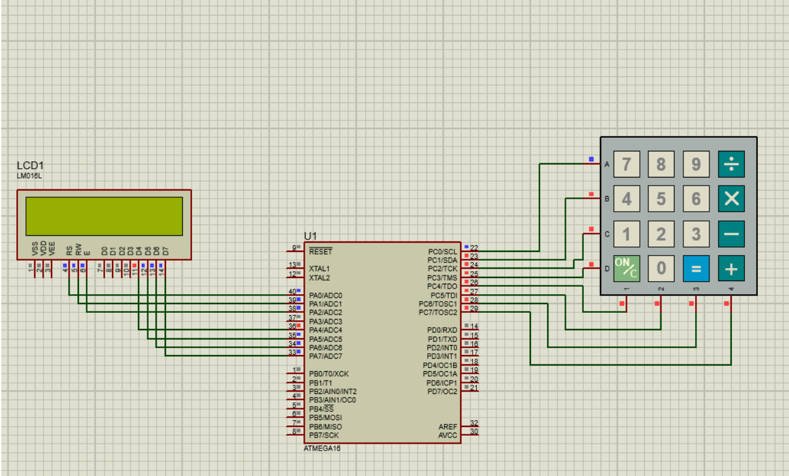

<!--
*** Thanks for checking out the Best-README-Template. If you have a suggestion
*** that would make this better, please fork the repo and create a pull request
*** or simply open an issue with the tag "enhancement".
*** Don't forget to give the project a star!
*** Thanks again! Now go create something AMAZING! :D
-->

<!-- PROJECT SHIELDS -->
<!--
*** I'm using markdown "reference style" links for readability.
*** Reference links are enclosed in brackets [ ] instead of parentheses ( ).
*** See the bottom of this document for the declaration of the reference variables
*** for contributors-url, forks-url, etc. This is an optional, concise syntax you may use.
*** https://www.markdownguide.org/basic-syntax/#reference-style-links
-->

  

  <h3 align="center"></h3>
  

    Operating System Project
     
  

<!-- TABLE OF CONTENTS -->

  
📗 <b>Table of Contents</b>

  <ol>
    <li>
      <a href="#🔰-about-the-project"> About The Project</a>
    </li>
    <li><a href="#⚡-how-it-works">How it Works</a></li>
  </ol>

<!-- ABOUT THE PROJECT -->
## 🔰 About The Project
This is a two-operand calculator with keypad and LCD,connected to the ATmega16 microcontroller. This is an assignment for Micro Processor Course. More information on [Document](document.pdf).

- Simulation in [Proteus](https://proteus.soft112.com/) software.

(<a href="#top">back to top</a>)

### Author
- [Mehrdad Shahidi](https://github.com/CyberKatze)

